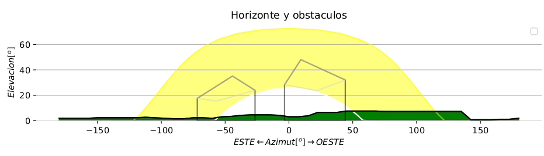

# Proyecto Solar

[📐DXF](Diseno/dxf){ .md-button }
[📍COORDENADAS](Diseno/coordenadas){ .md-button }

## **Planos en DXF y listados XLS**

### 🚀 **Preparado para recibir superpoderes ?  Cambia en tu cronograma los dias por segundos **

Con ProyectoSolar, en  segundos generas  planos, listados, documentacion para tramitar la licencia de obras y legalizacion de tu proyecto FV, que tardarias  dias en hacer:

* Modelado de sombras en la cubierta de edificios.
* Calculo de las perdidas por sombras directamente a partir del dxf.
* Genera el plano con la distribucion optima de placas mediante tecnicas de IA.
* Los esquemas electricos para cada distribucion y tipo de inversor.
* listados excel de paneles e inversores
* Plano de las perdidas por sombras
* … y muchas mas caracteristicas

**This is your new superpower; why go to work without it?**

[👉  Desde DXF](Diseno/dxf){ .md-button }

### **🚀 Caracteristicas**

**Run Python Files From Excel**

After
 locating your Python interpreter, you can execute Python files directly
 from Excel. In the Pro Version, you can also add several Python
interpreter paths. This is helpful when you need to execute your Python
code from different virtual environments.

**Create Pandas Dataframes**

Generate
 Python files with a click of a button. Select the cell range you want
to transform, and the add-in creates the Python code to read in the
Excel data as a pandas dataframe.Instead of messing around with all of
the available options in the pandas ‘read_excel’ method, the add-in does
 it for you.

**Create Jupyter Notebooks**

Have
 you ever wanted to do some quick analysis of your Excel data in a
Jupyter Notebook? MyToolBelt can convert an Excel cell range into a
Jupyter Notebook. Just select the cell range, and the add-in will create
 a new Jupyter Notebook in the workbook’s directory. Inside the Jupyter
Notebook, you will find your ready-to-use dataframe based on your
selection. This feature is a real time saver!

---

### **📺 Demo**

<iframe src="https://www.youtube.com/embed/PmJ9rkKGqrI" allow="autoplay; encrypted-media" allowfullscreen="" width="704" height="528" frameborder="0"></iframe>

---

### **🙋‍♀️ FAQ**

??? question "hjkgkjhgjg jgjgjh "
    khkjh

??? question "hjkgkjhgjg jgjgjh "
    khkjh
??? question "hjkgkjhgjg jgjgjh "
    khkjh
??? question "hjkgkjhgjg jgjgjh "
    khkjh
??? question "hjkgkjhgjg jgjgjh "
    khkjh
??? question "hjkgkjhgjg jgjgjh "
    khkjh

---
