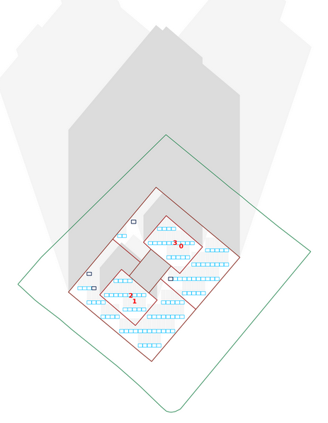

#

??? Info "**🚀 Diseno FV ( DXF o Lat/Lon)** "

    ??? question "a partir del dxf de la finca."

        * disenamos su planta FV si nos da [📐DXF](Diseno/dxf){ .md-button }

        

    ??? question "con solo las coordenadas."

        * disenamos su planta FV si nos da [📍COORDENADAS](Diseno/coordenadas){ .md-button }

        

??? Abstract "**🚀 Documentacion en  (pdf, Excel y Autocad)**"

    ??? question "Genera el plano con la distribucion optima de placas mediante tecnicas de IA."

        * o tambien con solo las 

        

    ??? question "Genera el plano con la distribucion optima de placas mediante tecnicas de IA."

        * o tambien con solo las [📍COORDENADAS](Diseno/coordenadas){ .md-button }

        

    ??? question "Los esquemas electricos para cada distribucion y tipo de inversor."

        

    ??? question "listados excel de paneles e inversores"

        

    ??? question "Plano de las perdidas por sombras"

        

??? Example "**📺 Demo**"

    <iframe src="https://www.youtube.com/embed/PmJ9rkKGqrI" allow="autoplay; encrypted-media" allowfullscreen="" width="704" height="528" frameborder="0"></iframe>

??? question "**🙋‍♀️ FAQ**"

    khkjh

    ??? question "hjkgkjhgjg jgjgjh "

        khkjh

    ??? question "hjkgkjhgjg jgjgjh "

        khkjh

    ??? question "hjkgkjhgjg jgjgjh "

        khkjh

    ??? question "hjkgkjhgjg jgjgjh "

        khkjh

    ??? question "hjkgkjhgjg jgjgjh "

        khkjh
